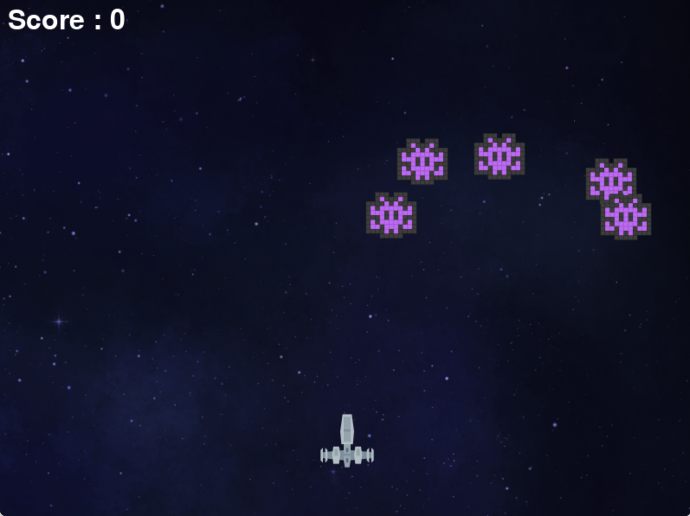
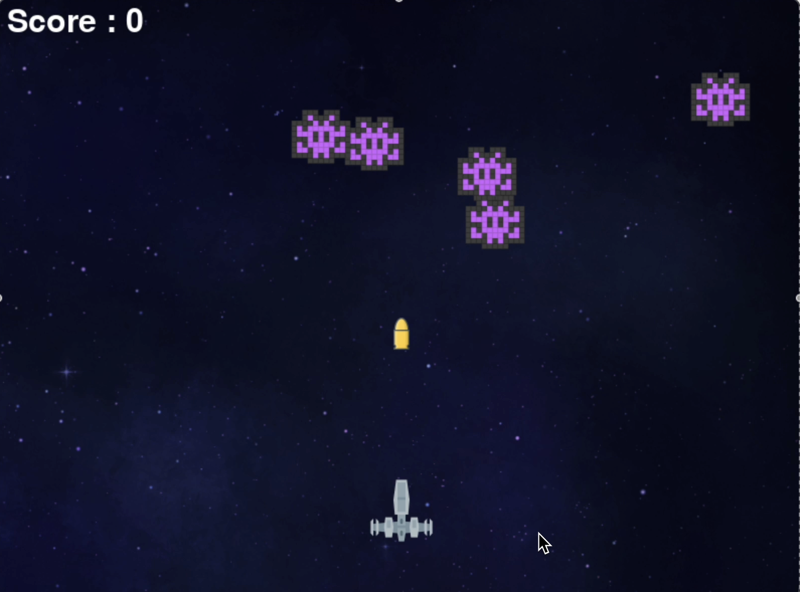

# 🚀 Space Invader Game 🎮

A classic arcade-style space shooter game built using **Python** and **Pygame**. Pilot your spaceship, shoot down waves of invading enemies, and try to get the highest score possible!


---

## 🕹️ Features

- Smooth player movement and controls
- Multiple enemy invaders with AI-like movement
- Shooting mechanics with bullet collision detection
- Scoring system
- Game Over and restart mechanism
- Background music and sound effects
- Engaging space-themed graphics

---

## 📦 Tech Stack

- **Language**: Python 3.x
- **Library**: Pygame

---

## 📸 Screenshots

| Gameplay | Bullet Shooting | Game Over |
|---------|-----------|-----------|
|  |  |  |


---

## 🚀 Getting Started

### Prerequisites

Make sure Python and Pygame are installed on your machine:

```bash
pip install pygame

```

### Run the Game

1. Clone this repository:
   ```bash
   git clone https://github.com/Rishikesh4089/Space-Invader.git
   ```

2. Navigate into the project directory:
   ```bash
   cd Space-Invader
   ```

3. Run the game:
   ```bash
   python main.py
   ```

---

## 🎮 Controls

- **← / → Arrow Keys**: Move left and right
- **Spacebar**: Shoot bullets
- **ESC**: Quit the game

---

## 🧠 Concept

This project is inspired by the classic *Space Invaders* arcade game. It helps reinforce key game development concepts such as:

- Object movement and boundary logic
- Collision detection
- Event handling and real-time input
- Game loops and rendering
- Sound and asset management

---

## 💡 Learning Goals

- Understand the basics of Pygame and 2D game architecture
- Practice Python with object-oriented principles
- Gain hands-on experience with collision logic and animations
- Learn how to manage game state and scoring

---

## 📁 Folder Structure

```
Space-Invader/
│
├── assets/             # Images, icons, and sound effects
├── main.py             # Game entry point
├── README.md           # Project description file
└── ...
```

---

## 🌟 Future Improvements

- 🔄 Multiple levels or increasing difficulty
- 💥 Power-ups and health bars
- 🧠 Smarter enemy AI
- 🏆 High score persistence
- 🎨 Better UI/UX and transition screens

---

## 📜 License

This project is open-source and available under the [MIT License](LICENSE).

---

### 🙌 Made with love by [Rishikesh](https://github.com/Rishikesh4089)
```

